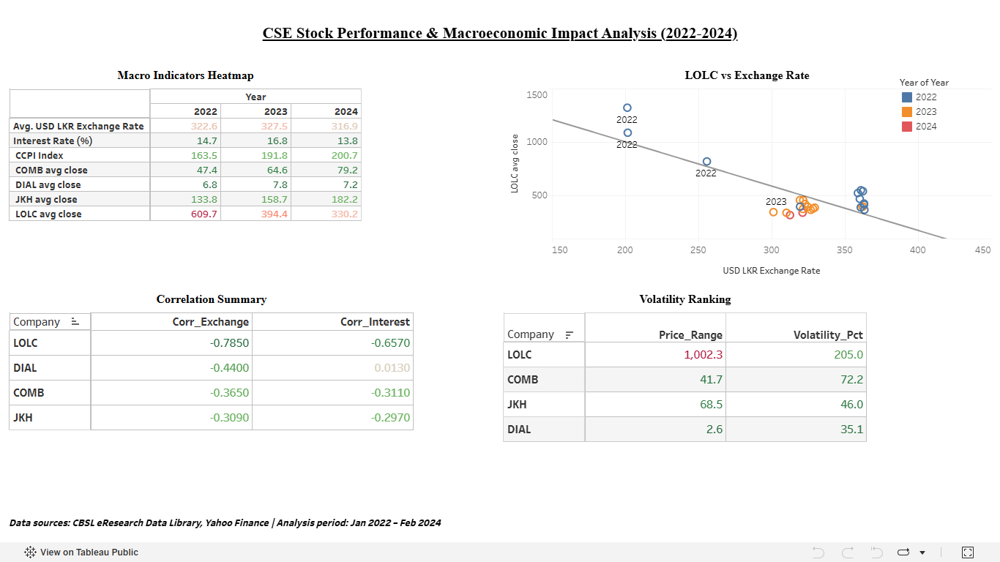

# CSE Stock Performance & Macroeconomic Impact Analysis

Analysis of how Sri Lankan macroeconomic indicators (inflation, USD/LKR
exchange rate, interest rates) correlate with stock performance across
four CSE-listed companies: John Keells Holdings (JKH), Commercial Bank
(COMB), LOLC Holdings (LOLC), and Dialog Axiata (DIAL), covering the
2022 economic crisis and the 2023–24 recovery period.

## 🔗 Interactive Dashboard
[View live dashboard on Tableau Public](https://public.tableau.com/app/profile/ravindu.lakruwan/viz/CSEStockPerformance/Dashboard2)

## Tools
Python (pandas) · PostgreSQL (SQL) · Tableau Public

## Methodology
1. **Data collection** — Daily stock prices for all four companies
   pulled via Python (`yfinance`); monthly macroeconomic indicators
   (exchange rate, interest rate, CCPI) sourced from the Central Bank
   of Sri Lanka's eResearch Data Library.
2. **Cleaning & transformation** — Daily stock data aggregated to
   monthly averages (pandas `groupby`); all datasets merged into a
   single time-series table keyed on month.
3. **Analysis** — Loaded into PostgreSQL and analyzed with SQL:
   crisis-vs-recovery comparisons, correlation coefficients (`CORR()`)
   between each stock and each macro indicator, and volatility
   ranking (price range as % of average price, to compare companies
   fairly across very different share price levels).
4. **Visualization** — Built an interactive Tableau Public dashboard
   combining summary tables, a correlation heat-map, and a scatter
   plot investigating the strongest relationship found (LOLC vs.
   exchange rate).

## Analysis Period
**2022-01 to 2024-02.** This window was chosen deliberately: the full
raw dataset spans 2020–2026, but CBSL's interest rate and exchange
rate series have reporting gaps in more recent months (see *Data
Limitations* below). The 2022–2024 window has 100% data completeness
across all core indicators and also captures the full arc of the
2022 crisis and the start of the recovery — the most analytically
interesting period in the dataset.

## Key Insights
- **LOLC (leasing/finance) is by far the most macro-sensitive stock**
  — strong negative correlation with the exchange rate (r = -0.785)
  and the highest volatility of the four (205% of its average price).
  This tracks with LOLC's own annual reports: as a leasing/finance
  group, rising interest rates raise its own borrowing costs (unlike
  a bank, which earns more from higher rates), and its international
  subsidiaries carry added currency risk.
- **DIAL (telecom) is the most stable and defensive stock** — close
  to zero correlation with interest rates (r = +0.013) and the lowest
  volatility (35%), consistent with a business model that isn't
  reliant on borrowing.
- **Sector labels don't tell the whole story.** LOLC and Commercial
  Bank are both "Financial Sector" companies, but they moved in
  *opposite* directions as interest rates rose — COMB benefited
  (higher lending income), LOLC was hurt (higher borrowing costs).
  The underlying revenue/funding model matters more than the sector
  label.
- **Recovery was uneven.** From 2022 to 2023-24, JKH (+21%) and COMB
  (+41%) rebounded strongly, DIAL was roughly flat (+13%), while LOLC
  kept declining (-37%) — suggesting its problems were structural
  (restructuring, currency exposure) rather than a temporary shock.
- **The LOLC–exchange rate relationship isn't a smooth decline** — a
  scatter plot shows a sharp break in early 2022 (price fell ~70% in
  four months) followed by stabilization at a new, lower price band
  through 2023–24, rather than a gradual, continuous slide.

## Data Limitations
Real-world data is rarely perfectly complete, and this project's data
was no exception. Documenting these gaps — rather than silently
filling them — was a deliberate part of the analysis process:

| Indicator | Missing period | Reason |
|---|---|---|
| CCPI Index | 2020-01 to 2021-12 | Series uses a 2021=100 base year; no index values exist before the base year |
| CCPI Year-on-Year % | 2020-01 to 2023-01 | Requires a full prior year of data to calculate; not usable as a core metric in this analysis |
| Avg. Weighted Lending Rate | 2024-03 onward | CBSL publication lag |
| USD/LKR Exchange Rate | 2025-09 onward | CBSL publication lag |

**How this was handled:** rather than mixing in data from a different
source (which risks inconsistent methodology), the analysis window
was scoped to 2022-01–2024-02, where CCPI Index, Interest Rate, and
Exchange Rate are all 100% complete. CCPI Year-on-Year % was excluded
from the core correlation analysis due to its gap, but the CCPI Index
itself (fully available) was used in its place. This scoping decision
is treated as a normal, transparent part of the analysis rather than
a flaw to hide.

## Data Sources
- **Central Bank of Sri Lanka (CBSL)** — exchange rates, interest
  rates (Average Weighted Lending Rate), CCPI (inflation)
- **Yahoo Finance** — historical daily share prices for JKH, COMB,
  LOLC, and DIAL

## Repository Contents
- Tableau Public dashboard (linked above)
- Analysis queries and data processing steps documented in this README
